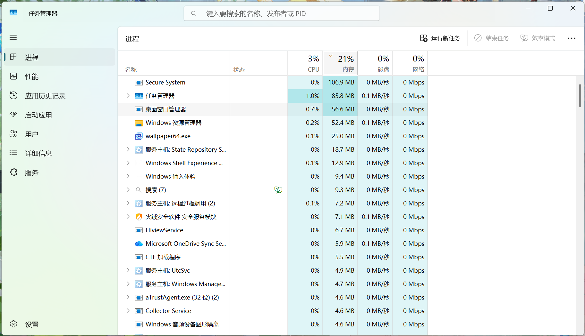
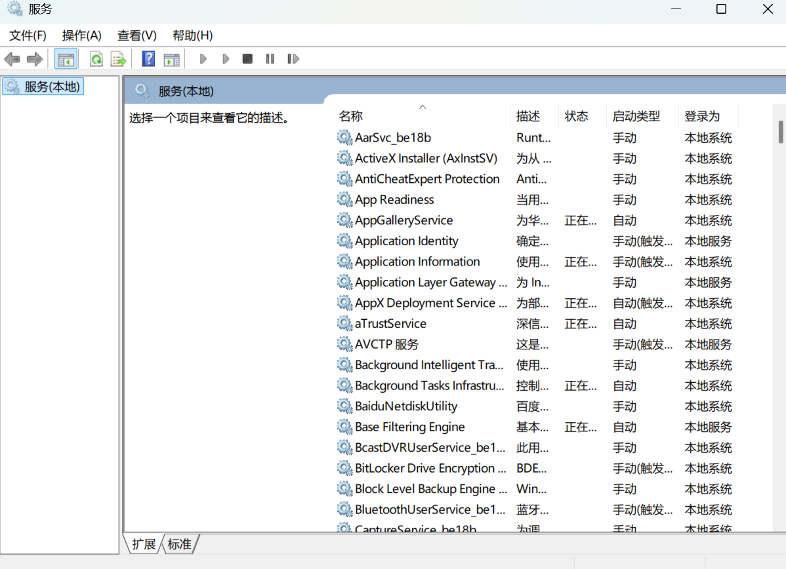

## 电脑内存优化+实用工具

在使用 Windows 的过程中，经常遇到一开机就占用一半内存的情况。对于我这种用轻薄本的核显打游戏的人来说，这更是灾难，于是我捣鼓出了一些门道。

这是优化后的常驻内存占用，优化前应该在 40% 左右。现在这样已经让我很满意了，其中还有不少内存是被我为了美化桌面而保留的软件占用的。~~（占用最多的就是小风车了）~~

- **启动优化：** 这是效果最显著的方式了。很多流氓软件会强制开机自启，平时很少用到的软件，就可以关闭它们的自启动。
    - 最简单的方式就是在设置里搜索“启动”，把一些没有必要的软件的自启动全部关掉。
    - 除此之外，Windows 中还有一些用不到的流氓服务，在任务管理器中结束任务后，它们又会反复启动。因此，我们需要将这些服务的启动类型改为“手动”，需要时再启动。

        1. 用 `Win + R` 打开“运行”，输入 `services.msc`，打开服务面板。
        2. 其中有些服务与硬件设备的驱动有关，有些则属于流氓软件。不同厂商的电脑预装的服务也不一样，我使用的华为电脑就预装了很多华为的服务。
        3. 熟悉这些服务的朋友，可以根据服务描述调整它们的启动类型；不懂的可以去问问 DS 或 GPT。
    
    下面是具体的界面：
    

- **运行优化：** Windows 开机之后，各种缓存会占用内存空间。这里我推荐一款工具：[MemReduct](https://github.com/henrypp/memreduct)。它用起来超级方便，下载后不用更改设置就能使用。当然，也可以设置一个快捷键，时不时清理一下，是释放内存的一把好手。

- **实用小工具：**
    - [PrivaZer](https://privazer.com/)：用来清理硬盘空间的工具。听说从没清理过的电脑能释放出 40 GB 的空间，但我自己只清理出了 3 GB。它主要清理一些注册表项、临时文件啥的。
    - [Geek](https://geekuninstaller.com/download)：用来彻底卸载软件的工具，避免残留文件浪费空间。
